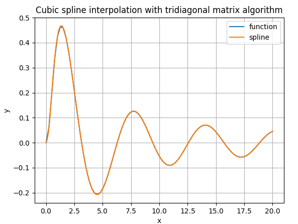
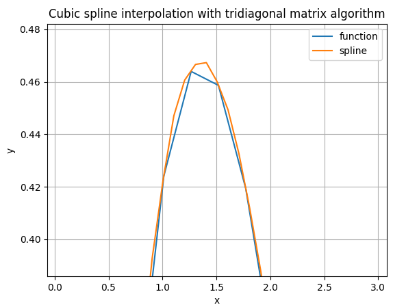

# Cubic Spline Interpolator

Tool for building splines based on pre-calculated (x, y) set of points.

## Requirements
- python3.8+
- pip
- virtualenv (optional)

### Pip packages
To install required packages use one of commands below

### Optional

Create `virtualenv` and enter it

`python3.8 -m virtualenv env && source env/bin/activate`

#### Linux
`python -m pip install -r requirements.txt`

#### Windows
TODO

## Usage

The script can be run as:

`python main.py --options`

The set of available options are:

 * `--range_start`: left range boundary, default=0.0, example: -7.5
 * `--range_end`: right range boundary, default=10.0, example: 5.0
 * `--step`: step between values in range, default=0.25, example: 0.1
 * `--compare_default/--do_not_compare`: compare custom spline with default `scipy` spline, default=False

## Example

Set range [0.0, 20.0] with step 0.1

`python main.py --range_end 20 --step 0.1`

### Output

Output contains:
 * function
 * first 20 pairs of function arguments and function results
 * first 20 pairs of spline arguments and interpolated values
 * spline coefficients on each step
 * interpolation error

```bash
Function: x * sin(x) / (1 + x * x)

Function arguments and results:

 x |  0.000 |  0.253 |  0.506 |  0.759 |  1.013 |  1.266 |
----------------------------------------------------------
 y |  0.000 |  0.060 |  0.195 |  0.332 |  0.424 |  0.464 |

Spline arguments and interpolated values:

 x |  0.000 |  0.101 |  0.201 |  0.302 |  0.402 |  0.503 |
----------------------------------------------------------
 y |  0.000 |  0.012 |  0.037 |  0.078 |  0.132 |  0.193 |


Coefficients on each step:

Step|    x    |    a    |    b    |    c    |    d    
------------------------------------------------------
  1 |   0.000 |   0.000 |   0.000 |   0.000 |   0.000
  2 |   0.101 |   0.060 |   0.510 |   3.250 |  12.838
  3 |   0.201 |   0.195 |   0.589 |  -1.006 | -16.811
  4 |   0.302 |   0.332 |   0.437 |  -0.697 |   1.221
  5 |   0.402 |   0.424 |   0.222 |  -1.344 |  -2.557
  6 |   0.503 |   0.464 |   0.029 |  -0.854 |   1.938
  7 |   0.603 |   0.459 |  -0.120 |  -0.748 |   0.417
  8 |   0.704 |   0.419 |  -0.225 |  -0.454 |   1.162
  9 |   0.804 |   0.357 |  -0.292 |  -0.303 |   0.598
 10 |   0.905 |   0.280 |  -0.328 |  -0.131 |   0.678

Interpolation error: 0.46589
```

### Plot

#### Full plot



#### Detailed part

