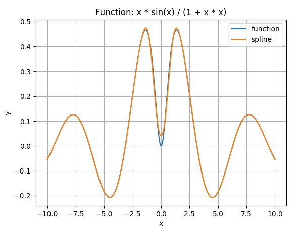

# Cubic Spline Interpolator

Tool for building splines based on pre-calculated (x, y) set of points.

## Requirements
- python3.8+
- pip
- virtualenv (optional)

### Pip packages
To install required packages use one of commands below

### Optional

Create `virtualenv` and enter it

`python3.8 -m virtualenv env && source env/bin/activate`

#### Linux
`python -m pip install -r requirements.txt`

#### Windows
TODO

## Usage

The script can be run as:

`python main.py --options`

The set of available options are:

 * `--range_start`: left range boundary, default=-10.0, example: -7.5
 * `--range_end`: right range boundary, default=10.0, example: 5.0
 * `--range_length`: number of values in range, default=30000, example: 1000
 * `--intervals`: number of intervals, default=10, example: 50
 * `--compare_default/--do_not_compare`: compare custom spline with default `scipy` spline, default=False

## Example

Set range [-10.0, 20.0] with 50 intervals

`python main.py --range_end 20 --intervals 50

### Output

Output contains:
 * function
 * first 8 pairs of arguments and function results
 * first 8 pairs of arguments and interpolated values
 * spline coefficients on each step
 * interpolation error

```bash
Function arguments and results:

 x | -10.000 |  -9.999 |  -9.999 |  -9.998 |  -9.997 |  -9.997 |  -9.996 |  -9.995 |
------------------------------------------------------------------------------------
 y |  -0.054 |  -0.054 |  -0.054 |  -0.054 |  -0.054 |  -0.054 |  -0.054 |  -0.053 |

Spline arguments and interpolated values:

 x | -10.000 |  -9.999 |  -9.999 |  -9.998 |  -9.997 |  -9.997 |  -9.996 |  -9.995 |
------------------------------------------------------------------------------------
 y |  -0.054 |  -0.054 |  -0.054 |  -0.054 |  -0.053 |  -0.053 |  -0.053 |  -0.053 |

Coefficients on each step:

Step|    x    |    a    |    b    |    c    |    d    
------------------------------------------------------
  1 | -10.000 |  -0.054 |   0.000 |   0.000 |   0.000
  2 |  -7.778 |   0.126 |  -0.031 |  -0.152 |  -0.068
  3 |  -5.556 |  -0.116 |  -0.095 |   0.094 |   0.111
  4 |  -3.333 |  -0.052 |   0.172 |   0.146 |   0.023
  5 |  -1.111 |   0.446 |   0.167 |  -0.150 |  -0.133
  6 |   1.111 |   0.446 |  -0.167 |  -0.150 |  -0.000
  7 |   3.333 |  -0.052 |  -0.172 |   0.146 |   0.133
  8 |   5.556 |  -0.116 |   0.095 |   0.094 |  -0.023
  9 |   7.778 |   0.126 |   0.031 |  -0.152 |  -0.111
 10 |  10.000 |  -0.054 |  -0.137 |   0.000 |   0.068

Interpolation error: 0.11198
```

### Plot

#### 10 intervals


#### 30 intervals

